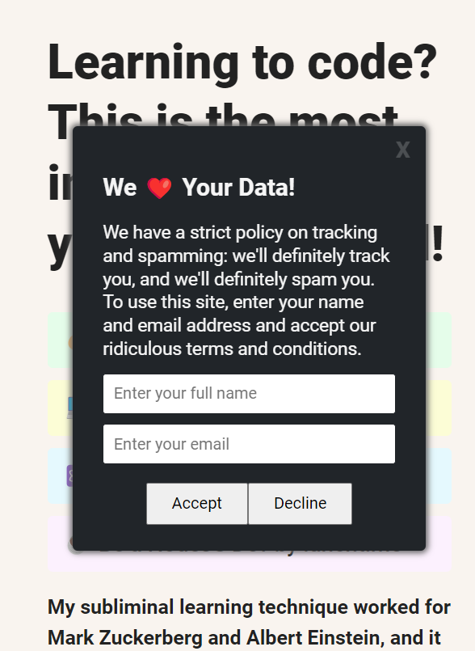

# The Most Annoying Cookie Consent

## Introduction

Welcome to "The Most Annoying Cookie Consent" project! In just 5 hours of dedicated development, I've crafted a cookie consent experience that's memorable, perhaps even a tad bit irritating, but fear not – your precious data is in the safest hands.

## Project Overview

This project is a showcase of my journey into the world of web development, where I explored various concepts and techniques while creating the ultimate cookie consent mechanism. Here's what I achieved:

- **Delayed Modal Magic**: Leveraging the power of the `setTimeout` function, I orchestrated a perfectly timed appearance of the cookie consent modal. Your consent won't go unnoticed!

- **Styling Sorcery with `element.style`**: Using `element.style`, I dynamically transformed the appearance of elements to give the cookie consent a distinct and eye-catching look.

- **Data Handling with `formData`**: I embraced the magic of `formData` to efficiently handle and process data, ensuring a seamless interaction between your choices and the consent process.

- **Class Toggle Frenzy**: Through skillful class toggling, I brought the cookie consent to life, making it the most animated and interactive part of your browsing experience , inspiration : scrimba!

## Usage

To witness "The Most Annoying Cookie Consent" in action, simply open the `index.html` file in your preferred web browser. Interact with the consent mechanism, experience the delayed modal, and rest assured that your valuable data is handled securely.

## Installation

No installation is required! Just clone this repository or download the ZIP file and open the `index.html` file in your web browser to dive into the world of cookie consent annoyance or live link is provided!

## Contribution

If you're interested in contributing to this quirky project, feel free to fork the repository, make your improvements, and submit a pull request. Let's make this cookie consent even more memorable – in the most annoying way possible!

## License

This project is licensed under the [MIT License](LICENSE), which means you're free to use, modify, and distribute it to your heart's content. Just remember, the cookie consent might get under your skin!

---

Let's embrace the world of coding with a touch of humor and a sprinkle of annoyance! 🍪🤪
